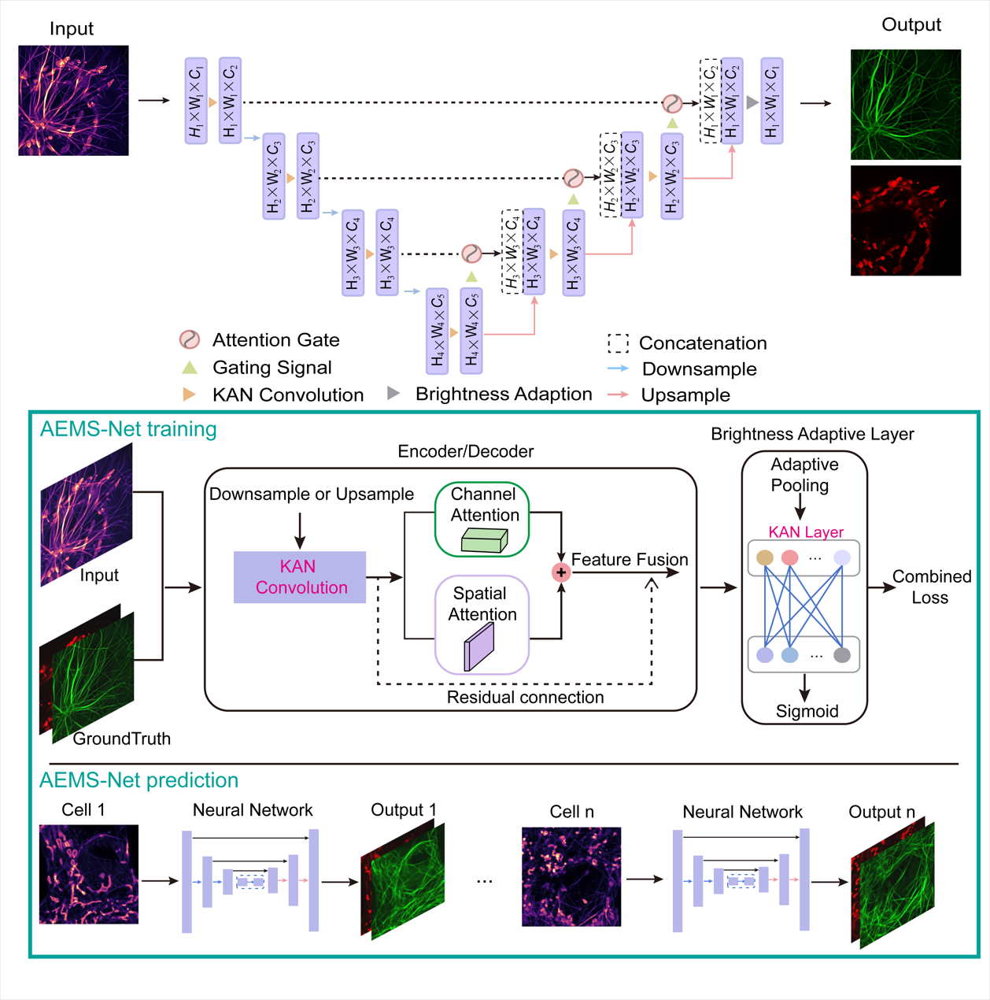
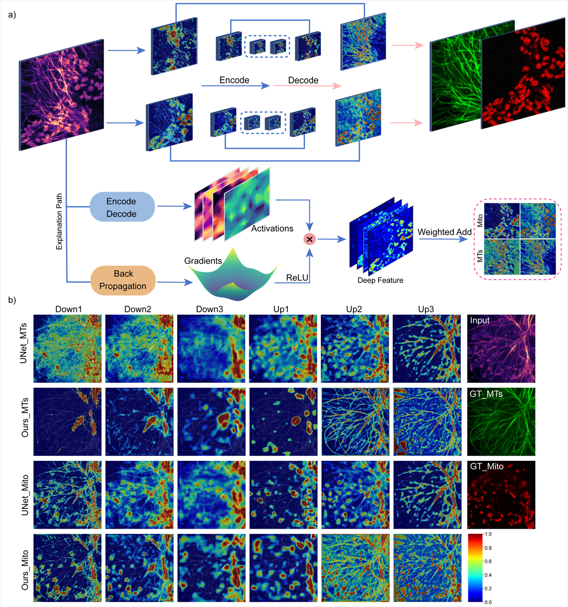

# AEMS-Net

The official implementation of **Interpretable deep learning illuminates multiple structures fluorescence imaging**.





## Content

- AEMS-Net
  - Dependencies
  - Quick test for performance
  - Quick test for interpretable analysis
  - Training method
  - Citation

## Dependencies

AEMS-Net was implemented on *Ubuntu 22.04* with *Python 3.10*. Before training and testing, please create a conda environment and install PyTorch 2.1.2 as follows:

```shell
conda create -n AEMSN python=3.10
source activate AEMSN
conda install torch==2.1.2
```

Besides, please install other packages using `pip install -r requirements.txt`.

## Quick test for performance

To validate the performance of AEMS-Net, we assessed its capabilities using the specialized dataset we developed.

|                | Mitochondria                            | Microtubule                              | total-number |
| -------------- | :-------------------------------------- | :--------------------------------------- | :----------: |
| **training**   | Cell_3: Sample_019.tif - Sample_033.tif | Cell_3: Sample_026.tif - Sample_045.tif  |     2142     |
|                | Cell_4: Sample_034.tif - Sample_050.tif | Cell_4: Sample_046.tif - Sample_065.tif  |              |
|                | Cell_6: Sample_059.tif - Sample_064.tif | Cell_6: Sample_082.tif                   |              |
|                | Cell_7: Sample_065.tif - Sample_071.tif | Cell_7: Sample_083.tif                   |              |
| **validation** | Cell_9: Sample_082.tif - Sample_084.tif |                                          |     117      |
|                | Cell_1: Sample_000.tif - Sample_008.tif | Cell_1: Sample_000.tif - Sample_007.tif  |              |
|                | Cell_8: Sample_072.tif - Sample_075.tif | Cell_8: Sample_084.tif                   |              |
| **testing**    | Cell_2: Sample_009.tif - Sample_018.tif | Cell_2: Sample_008.tif - Sample_025.tif  |     720      |
|                | Cell_5: Sample_051.tif - Sample_058.tif | Cell_5: Sample_066.tif - Sample_081.tif  |              |
|                |                                         | Cell_10: Sample_082.tif - Sample_084.tif |              |

The setting of test directory is defined in `test.py` as follows:

```python
 ckpt = torch.load(f'model path')
    try:
        model.load_state_dict(ckpt)
    except:
        model.load_state_dict(ckpt, strict=False)
```

To evaluate the performance of U-Net and AEMS-Net on the previously acquired dataset, navigate to the `demo.sh` script below and uncomment the respective lines corresponding to the desired model. Subsequently, execute the command in `demo.sh` to initiate the performance assessment.

```shell
# demo.sh
# test U-Net
$ cd test/
$ python test.py --model_name UNet --data_dir 'datasets path' --output_dir 'output path' --input_channels 1 --num_classes 2

# test AEMS-Net
$ cd test/
$ python test.py --model_name AEMSN --data_dir 'datasets path' --output_dir 'output path' --input_channels 1 --num_classes 2
```


## Quick test for interpretable analysis

Update the following configuration in the `analysis.py` file

```python
# for AEMSN
model = ImprovedAemsn(n_channels=n_channels, n_classes=n_classes)
# for U-Net
model = UNet(n_channels=n_channels, n_classes=n_classes)

# path 
model_path = r"best_model.pth path"
n_channels, n_classes = 1, 2
loaded_model = load_model(model_path, n_channels, n_classes)

input_directory = r"the input image directory path"
save_directory = r"saved output directory path"
target_layers = ['down1', 'down2', 'down3', 'down4', 'up1', 'up2', 'up3', 'up4']
```

To conduct an interpretable analysis, execute the following command:

```shell
$ cd interpretable_module/
$ python analysis.py
```


## Training method

To train the UNet and AEMS-Net models, please uncomment the corresponding lines in the script, and then execute the script.

```shell
# train U-Net
$ cd train/
$ python train.py --model_name UNet --epochs 101 --batch_size 8 s --data_dir 'datasets path' --output_dir 'output path' --input_channels 1 --num_classes 2 


# train AEMS-Net 
$ cd train/
$ python train.py  --model_name AEMSN --epochs 101 --batch_size 8 s --data_dir 'datasets path' --output_dir 'output path' --input_channels 1 --num_classes 2 

```


## Citation


If you have any questions, Contact us via mingyangcheng@stu.hznu.edu.cn.

